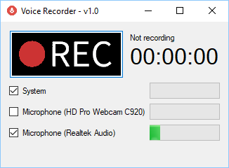

# VoiceRecorder

Very light application to record all sounds from your PC.
No installation, no configuration:

1. **Download** the [last release version](https://github.com/dvoituron/VoiceRecorder/releases) 
   and **extract** the zip file contents on your PC.
2. Run the **VoiceRecorder.exe** application. May be you need to run as an Administrator.
3. Check all sound cards to be recorded and press the **[REC]** button.

>The **mp3 files** are saved in the **same folder** as the application.

